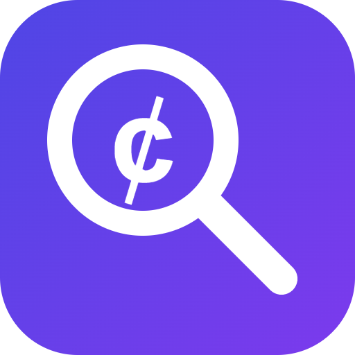

  

# PointLens

**English** | [简体中文](README.zh-CN.md)

**Hotel points value, at a glance.**

PointLens is a Chrome extension that shows how much value you get from hotel
points while you browse hotel websites. Compare cash and award rates directly
in search results, room listings, and maps—without keeping a calculator or a
second set of tabs open.

[Download the latest release](https://github.com/cocdeshijie/PointLens/releases/latest) ·
[Report a bug](https://github.com/cocdeshijie/PointLens/issues) ·
[Development guide](pointlens/README.md)

## What you see

A small badge sits next to the hotel's price:

| Browsing with cash | Browsing with points | Compact map marker |
| --- | --- | --- |
| `1.00¢/pt · 30,000 pts` | `1.00¢/pt · $300.00` | `1.00¢/pt` |

*Illustrative example: a $300 night available for 30,000 points, with no award cash charges.*

Open the **ⓘ** details to see the available cash, points, base rate, fees, and
totals behind the comparison. Colors reflect your own value thresholds for
each hotel program.

## Supported hotel programs

| Hotel website | Loyalty program |
| --- | --- |
| [Hilton](https://www.hilton.com/) | Hilton Honors |
| [IHG](https://www.ihg.com/) | IHG One Rewards |
| [Marriott](https://www.marriott.com/) | Marriott Bonvoy |
| [Hyatt](https://www.hyatt.com/) | World of Hyatt |
| [Wyndham](https://www.wyndhamhotels.com/) | Wyndham Rewards |
| [Choice Hotels](https://www.choicehotels.com/) | Choice Privileges |
| [Best Western](https://www.bestwestern.com/) | Best Western Rewards |
| [Sonesta](https://www.sonesta.com/) | Sonesta Travel Pass |

Coverage includes supported search, room/rate, and map views. Individual page
layouts and available pricing data vary by site.

## Features

- **Cash and points together.** See points alongside cash prices, or the cash
  comparison when browsing award rates.
- **Map comparisons.** Scan compact CPP labels and open hotel previews for
  more detail. Best Western pins show value before selection; Sonesta labels
  stay fitted to their boxes through map updates.
- **Room-aware matching.** Compare matching rooms and rate options where
  available. Hotel-level comparisons can use the lowest available alternative;
  details identify fallback comparisons. Room-specific availability rules vary
  by brand, and unavailable awards are shown explicitly.
- **Useful price breakdowns.** Inspect available base rates, taxes, fees, stay
  totals, and award cash charges. Missing data stays unknown; estimated charges
  are labeled.
- **Your definition of good value.** Set good and poor CPP thresholds and
  choose before-tax or after-tax comparisons separately for each program.
- **Update reminders.** A notice at the bottom of the popup links to the newest
  GitHub release page when a newer version is available. Checks run at most once
  a day when you open the popup; updates are installed manually.
- **Light, dark, or system appearance.** Choose the extension popup theme you prefer.
- **Accessible details.** Open comparison tooltips with a mouse, keyboard, or click.
- **Limited extra requests.** Reuse pricing already loaded by hotel websites.
  Where a companion lookup is needed, caching, request budgets, and cooldowns
  help avoid duplicate requests and respect rate limits. Sonesta adds no extra
  pricing requests.

## Install in Chrome

1. Download the `point-lens-…-chrome.zip` asset from the
   [latest release](https://github.com/cocdeshijie/PointLens/releases/latest).
2. Extract it into a folder you will keep on your computer.
3. Open `chrome://extensions` and turn on **Developer mode**.
4. Click **Load unpacked** and select the extracted folder containing `manifest.json`.
5. Pin PointLens from Chrome's Extensions menu, then refresh any open hotel pages.

Search a supported hotel website as usual. Open the PointLens popup to adjust
that program's settings or choose another program.

To update, extract the new release into the same extension folder, click
**Reload** in `chrome://extensions`, and refresh your hotel pages.

## How CPP works

**Cents per point = (comparable cash price − cash charges on the award) ÷ points × 100.**

PointLens uses matching stay lengths and the selected tax basis. For example,
a $300 cash rate versus 30,000 points is **1.00¢/pt**. If the award also requires
$50 in cash charges, the value is approximately **0.83¢/pt**.

Foreign-currency comparisons use exchange rates to express CPP in US cents.
A higher CPP means more cash saved per point in that comparison; it does not
account for every difference in cancellation terms, included extras, or rewards
you might earn on a paid stay. Check the hotel's final booking terms and total.

## Data and permissions

PointLens reads supported hotel pages and their pricing responses, and stores
preferences and cached data in browser storage. Its current manifest requests
HTTPS site access, plus `scripting`, `webRequest`, `tabs`, and `storage` for the
page integrations and popup. Currency conversion makes requests to
`open.er-api.com` and caches successful rates for 24 hours. Update checks request
public release metadata from `api.github.com` without credentials and cache
the result locally.

Hotel websites change frequently. A missing badge can mean pricing is still
loading, an award is unavailable, a request failed, or a page layout needs an
adapter update. Sonesta award taxes and fees currently remain estimates;
signed-in award checkout has not yet been verified.

## Development and feedback

The extension uses **TypeScript, React, and Plasmo**, targeting Chrome Manifest V3.
Each hotel adapter lives in `pointlens/hotels/<brand>/` with its own settings
and popup component. See the [development guide](pointlens/README.md) for build
commands, fixture-based tests, and site-specific implementation notes.

For a bug report, include the hotel website, affected view, stay dates, cash or
points mode, extension version, and expected behavior. A screenshot with personal
details removed is helpful. Please avoid posting cookies, credentials, or booking
confirmations in issues.

PointLens is an independent project and is not affiliated with or endorsed by
the hotel brands listed above. Brand names and logos belong to their respective owners.
